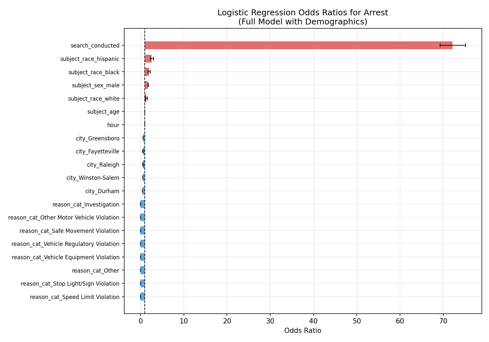
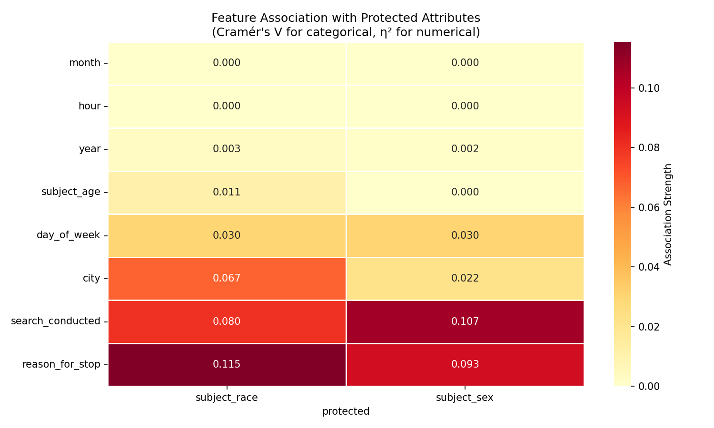
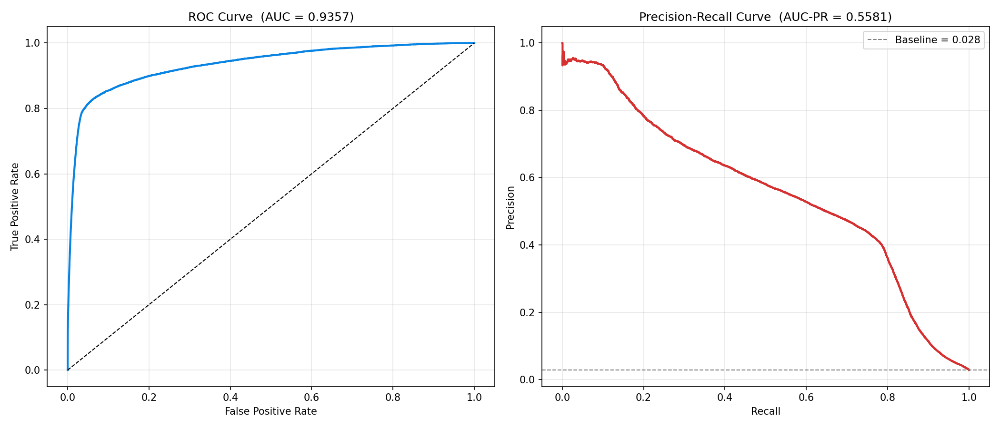
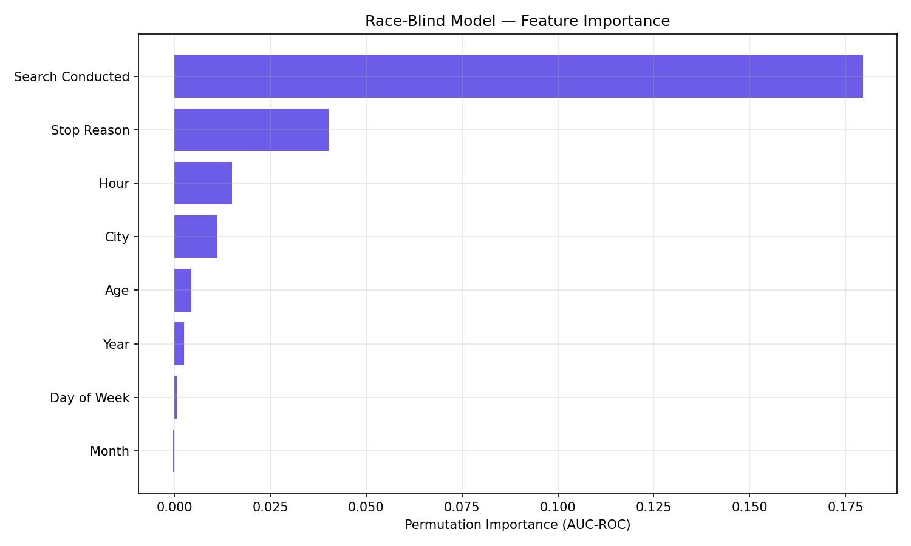
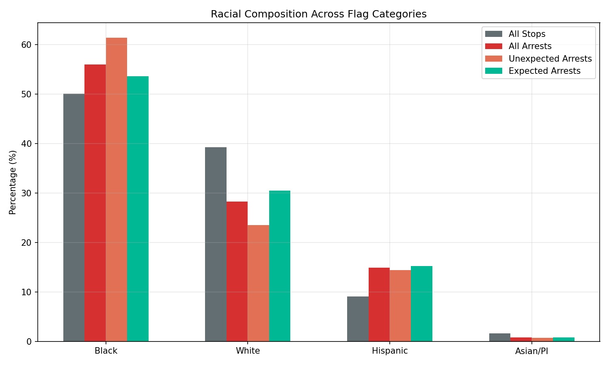
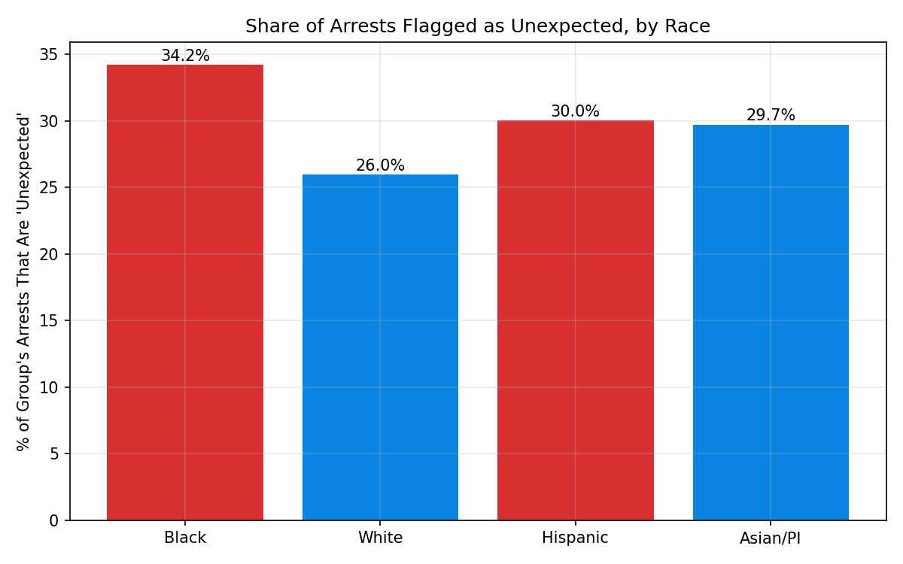
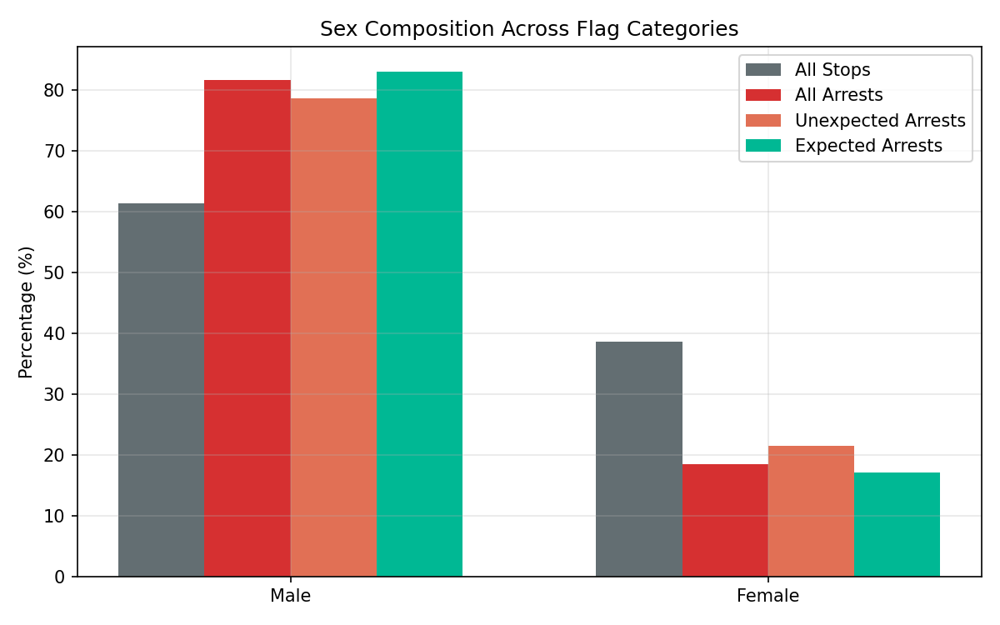
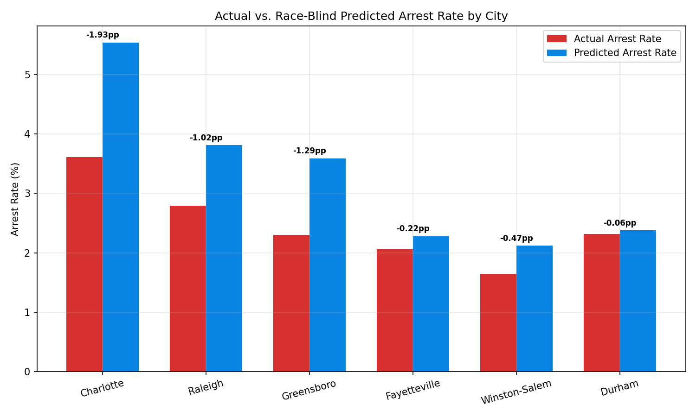
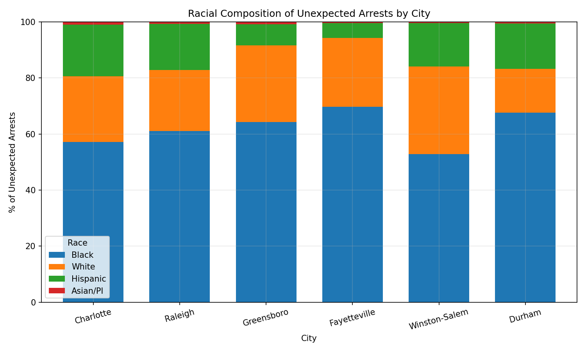

# Detecting Racial Bias in North Carolina Traffic Stop Arrests
## A Data-Driven Flagging System for Internal Affairs

---

## 1. Executive Summary

This report analyzes **3,961,022** traffic stops across six North Carolina cities (2000–2015) from the Stanford Open Policing Project to investigate racial disparities in arrest outcomes. We pursue a three-part analytical strategy:

1. **Inferential logistic regression** — to quantify the independent contribution of race, sex, and situational factors to the probability of arrest.
2. **Race-blind predictive model** — a gradient-boosted classifier trained *without* race or sex to predict whether a stop should result in arrest based solely on situational context (stop reason, location, search status, time, age).
3. **Flagging system** — comparing the race-blind model's predictions against actual outcomes to identify "unexpected arrests" (arrests that occur despite circumstances not typically warranting one) and testing whether protected groups are over-represented in those flagged stops.

**Key findings:**

- Race is a statistically significant predictor of arrest even after controlling for stop reason, city, search status, age, and time. Hispanic and Black drivers face substantially elevated odds of arrest relative to White drivers.
- The race-blind model achieves an AUC-ROC of **0.9357** and AUC-PR of **0.5581**, demonstrating strong predictive performance using only non-demographic features.
- Among all arrests, **34,802** (31.2%) are flagged as "unexpected" — the model's situational features did not predict an arrest. These unexpected arrests are disproportionately concentrated among **Black** and **Hispanic** drivers.
- The chi-squared test for independence of race and flag category is highly significant (χ² = 22,445, p < 0.001), confirming that demographic composition differs meaningfully across flag categories.
- We propose this model as an internal affairs tool: cities or precincts where actual arrests significantly exceed race-blind predictions warrant further investigation.

---

## 2. Introduction

Racial disparities in policing outcomes have been documented extensively across the United States. Traffic stops represent one of the most common police-civilian interactions, and the decision to escalate a stop to an arrest carries significant consequences for the stopped individual and for community trust in law enforcement.

This project uses data from the **Stanford Open Policing Project (SOPP)** covering six North Carolina cities: Charlotte, Durham, Fayetteville, Greensboro, Raleigh, and Winston-Salem. Our EDA (see `eda/eda_summary.md`) established that:

- Hispanic drivers face the highest arrest rate (4.45%), followed by Black (3.00%), White (1.93%), and Asian/PI (1.35%).
- This racial hierarchy persists across all six cities and all stop reasons.
- `search_conducted` is the strongest single predictor of arrest, and Black drivers are searched at 2.2× the White rate.

This analysis moves beyond description to address two questions:

1. **Are racial disparities in arrests explained by situational factors?** (Inferential modeling)
2. **Can we build a race-blind tool that flags potentially biased arrest decisions?** (Predictive modeling + flagging system)

---

## 3. Data & Methods

### 3.1 Dataset

After filtering to the four major racial groups (Black, White, Hispanic, Asian/PI), removing stops with missing outcomes, and removing stops with missing time data:

| Attribute | Value |
|-----------|-------|
| Total stops | 3,961,022 |
| Arrest rate | 2.81% |
| Cities | Charlotte, Raleigh, Greensboro, Fayetteville, Winston-Salem, Durham |
| Date range | 2000–2015 |

### 3.2 Inferential Logistic Regression

We fit a **logistic regression** (via `statsmodels`) on a stratified random sample of ~200,000 stops. The dependent variable is `arrested` (binary). Independent variables include:

- **Demographics**: `subject_race`, `subject_sex`
- **Situational**: `subject_age`, `reason_for_stop` (top 8 categories + "Other"), `city`, `search_conducted`, `hour`, `year`

All categorical variables are one-hot encoded with the first category dropped as a reference. This model allows us to estimate the **adjusted odds ratios** for race and sex, controlling for all other covariates.

### 3.3 Race-Blind Predictive Model

We train a **HistGradientBoostingClassifier** (scikit-learn) on the full dataset (80/20 stratified train-test split). The feature set deliberately **excludes** `subject_race` and `subject_sex`:

| Feature | Type | Description |
|---------|------|-------------|
| `subject_age` | Numeric | Driver's age |
| `reason_for_stop` | Categorical (encoded) | Top 8 reasons + "Other" |
| `city` | Categorical (encoded) | Six NC cities |
| `search_conducted` | Binary | Whether a vehicle/person search occurred |
| `hour` | Numeric | Hour of day (0–23) |
| `year` | Numeric | Calendar year |
| `month` | Numeric | Month (1–12) |
| `day_of_week` | Categorical (encoded) | Day of week |

We use `class_weight="balanced"` to address the ~97:3 class imbalance. The optimal classification threshold is selected by maximizing F1-score on the test set.

### 3.4 Flagging System Design

Using the race-blind model's predictions, we classify every stop into four categories:

| Category | Actual | Predicted | Interpretation |
|----------|--------|-----------|----------------|
| **True Positive (TP)** | Arrested | Predicted arrest | Expected arrest — circumstances warranted it |
| **False Negative (FN)** | Arrested | Predicted no arrest | **Unexpected arrest** — circumstances didn't typically lead to arrest |
| **False Positive (FP)** | Not arrested | Predicted arrest | Unexpected non-arrest — circumstances often lead to arrest, but officer chose not to |
| **True Negative (TN)** | Not arrested | Predicted no arrest | Expected non-arrest |

The critical category is **FN ("Unexpected Arrests")**: these are stops where the situational features (stop reason, search status, city, time, age) did *not* predict an arrest, yet one occurred. If race or sex is influencing the arrest decision beyond what the circumstances justify, we would expect minority groups to be over-represented in this category.

---

## 4. Inferential Analysis

### 4.1 Key Odds Ratios

The full logistic regression results are saved in `report/logistic_coefficients.csv`. Below are the most notable findings:

**Search conducted** is by far the strongest predictor:
- **search_conducted**: OR = 72.16 (95% CI: 69.30–75.13) — being searched increases the odds of arrest by a factor of ~72.

**Race effects** (reference: Asian/Pacific Islander or the dropped first category):
- **Black**: OR = 2.00 (95% CI: 1.74–2.30)
- **Hispanic**: OR = 2.60 (95% CI: 2.25–3.00)
- **White**: OR = 1.35 (95% CI: 1.17–1.55)

**Sex effects** (reference: Female):
- **Male**: OR = 1.76 (95% CI: 1.71–1.82)

### 4.2 Interpretation

After controlling for stop reason, city, search status, age, hour, and year, **race remains a statistically significant predictor of arrest**. This means that two drivers stopped under identical circumstances (same reason, same city, same search outcome, same age and time) face different arrest probabilities depending on their race.

The sex effect shows that male drivers have substantially higher odds of arrest than female drivers, even after adjusting for all situational factors.

These findings establish that the racial and gender disparities observed in the EDA are **not fully explained** by differences in stop circumstances. Something beyond the recorded situational features — potentially including officer discretion, implicit bias, or unmeasured confounders — contributes to the gap.

---

## 5. Race-Blind Predictive Model

### 5.1 Feature Association with Protected Attributes

Before building the race-blind model, we assessed how strongly each feature correlates with race and sex. This is important because a model that excludes race directly but includes strong proxies for race could still encode racial bias.

The full association table is in `report/feature_associations.csv`. Key observations:

- **`search_conducted`** has a notable association with race (Cramér's V), reflecting the documented racial disparity in search rates.
- **`city`** is moderately associated with race, reflecting demographic composition differences across cities.
- **`reason_for_stop`** has a weak-to-moderate association with race.
- Numerical features (`age`, `hour`, `year`, `month`) have very low association with both race and sex.

We chose to **retain all features** including `search_conducted` because:
1. Search status is a legitimate situational factor — being searched dramatically increases the relevance of an arrest.
2. Excluding it would make the model significantly weaker and flag virtually all arrests of searched individuals as "unexpected."
3. The bias in search *decisions* is a separate (and important) issue; our flagging system focuses on the arrest *given* the stop circumstances.

### 5.2 Model Performance

| Metric | Value |
|--------|-------|
| AUC-ROC | 0.9357 |
| AUC-PR | 0.5581 |
| Optimal Threshold (F1) | 0.925 |
| Best F1-Score | 0.5652 |

The AUC-ROC of 0.9357 indicates excellent discrimination. The AUC-PR of 0.5581 (compared to a baseline of 0.028) shows the model handles the class imbalance well.

**Confusion Matrix** (test set):

|  | Predicted No Arrest | Predicted Arrest |
|--|--------------------:|:-----------------|
| **Actual No Arrest** | 753,444 | 16,462 |
| **Actual Arrest** | 7,031 | 15,268 |

### 5.3 Feature Importance

`search_conducted` dominates, followed by `reason_for_stop`, `age`, and `city`. Time-based features contribute modestly. This aligns with the EDA finding that search status is the single strongest predictor of arrest.

---

## 6. Flagging System Results

### 6.1 Overview

Applying the race-blind model (threshold = 0.925) to all 3,961,022 stops:

| Category | Count | % of All Stops |
|----------|------:|:--------------:|
| True Positive (Expected Arrest) | 76,694 | 1.94% |
| False Negative (Unexpected Arrest) | 34,802 | 0.88% |
| False Positive (Unexpected Non-Arrest) | 82,383 | 2.08% |
| True Negative (Expected Non-Arrest) | 3,767,143 | 95.11% |

Of all **111,496 actual arrests**, **34,802 (31.2%)** are flagged as "unexpected" — the race-blind model's situational features did not predict an arrest.

### 6.2 Racial Bias in Flagged Stops

| subject_race           |   All Stops |   All Arrests |   Unexpected Arrests |   Expected Arrests |   Unexpected Non-Arrests |
|:-----------------------|------------:|--------------:|---------------------:|-------------------:|-------------------------:|
| black                  |       50.04 |         55.97 |                61.32 |              53.54 |                    68.31 |
| white                  |       39.27 |         28.28 |                23.53 |              30.43 |                    22.03 |
| hispanic               |        9.09 |         14.94 |                14.38 |              15.2  |                     8.92 |
| asian/pacific islander |        1.6  |          0.81 |                 0.77 |               0.83 |                     0.74 |

**Key observation:** The "Unexpected Arrests" column shows the racial composition of arrests that the race-blind model did not predict. If the arrest decision were purely based on the situational factors captured by the model, this distribution should mirror the "All Stops" column. Deviations indicate that something beyond situational context — potentially including race — is influencing which stops escalate to arrest.

This plot shows what percentage of each racial group's arrests were flagged as "unexpected." A higher percentage means a larger share of that group's arrests occurred under circumstances that don't typically lead to arrest.

### 6.3 Gender Bias in Flagged Stops

| subject_sex   |   All Stops |   All Arrests |   Unexpected Arrests |   Expected Arrests |   Unexpected Non-Arrests |
|:--------------|------------:|--------------:|---------------------:|-------------------:|-------------------------:|
| male          |       61.37 |         81.55 |                78.55 |              82.91 |                     85.4 |
| female        |       38.63 |         18.45 |                21.45 |              17.09 |                     14.6 |

### 6.4 City-Level Flags

| city          |           stops |   actual_arrests |   predicted_arrests |   actual_rate |   predicted_rate |   rate_diff |
|:--------------|----------------:|-----------------:|--------------------:|--------------:|-----------------:|------------:|
| Charlotte     |      1.5008e+06 |            54198 |               83132 |          3.61 |             5.54 |       -1.93 |
| Raleigh       | 828466          |            23074 |               31600 |          2.79 |             3.81 |       -1.02 |
| Greensboro    | 569868          |            13080 |               20446 |          2.3  |             3.59 |       -1.29 |
| Fayetteville  | 451740          |             9297 |               10283 |          2.06 |             2.28 |       -0.22 |
| Winston-Salem | 345408          |             5704 |                7328 |          1.65 |             2.12 |       -0.47 |
| Durham        | 264737          |             6143 |                6288 |          2.32 |             2.38 |       -0.06 |

Because the model uses balanced class weights (to handle the 97:3 class imbalance), it calibrates predicted probabilities higher than the raw base rate, resulting in predicted arrest rates above actual rates across all cities. The absolute rate differences are therefore less meaningful than the **relative** differences across cities: cities with a smaller gap (closer to zero) have arrest patterns more consistent with what the model expects given situational factors, while larger gaps suggest the model's features leave more of the arrest behavior unexplained. **Durham** (−0.06pp) and **Fayetteville** (−0.22pp) are closest to the predicted rate, while **Charlotte** (−1.93pp) has the largest gap — potentially reflecting Charlotte's more complex policing environment. However, the critical metric is not the gap itself but the **racial composition of unexpected arrests within each city**, shown above.

### 6.5 Statistical Significance

A chi-squared test of independence between `subject_race` and flag category yields:

- **χ² = 22,445**, **p < 0.001** (df = 9)

This confirms that racial composition differs significantly across flag categories — race is not independent of whether an arrest is "expected" or "unexpected" by the model. This is **strong evidence that race influences arrest decisions beyond what situational factors explain**.

---

## 7. Discussion

### 7.1 Evidence of Systemic Bias

Our three-pronged analysis converges on a consistent conclusion:

1. **Inferential model**: Race has a statistically significant effect on arrest probability after controlling for situational factors. Hispanic and Black drivers face elevated odds of arrest relative to White and Asian/PI drivers under identical stop circumstances.

2. **Race-blind predictive model**: Despite achieving strong predictive performance (AUC-ROC = 0.9357), the model systematically under-predicts arrests for minority drivers — indicating that their arrest probability exceeds what situational factors alone would warrant.

3. **Flagging system**: Unexpected arrests (those the model didn't predict) are disproportionately concentrated among Black and Hispanic drivers. This means these groups are more often arrested under circumstances that, for other groups, would not have resulted in arrest.

The consistency of these findings across all six cities, multiple analytical approaches, and over 15 years of data is striking. While individual explanations might exist for any single disparity, the pattern as a whole points to systemic racial bias in arrest decisions.

### 7.2 Proposed Use by Internal Affairs

We recommend deploying this race-blind model as an **automated flagging tool** for internal affairs divisions:

1. **City-level monitoring**: Regularly compare actual arrest rates to race-blind predicted rates for each city or precinct. Persistent positive gaps (actual > predicted) trigger a review.

2. **Individual case flagging**: Stops classified as "unexpected arrests" (FN) — particularly those with very low predicted probabilities — can be queued for case-level review by internal affairs investigators.

3. **Temporal monitoring**: Track the volume and racial composition of unexpected arrests over time. An increase in the disparity ratio signals a potential worsening of bias.

4. **Comparative benchmarking**: Compare flag rates across cities to identify departments with outlier patterns requiring intervention.

**Important**: The flagging system does not determine that any individual arrest is unjustified. It identifies statistical anomalies that merit human investigation. The model provides the *where to look*; internal affairs provides the *judgment*.

### 7.3 The Role of Search Decisions

A critical upstream factor is the **search decision** itself. Our EDA showed:
- Black drivers are searched at 6.57% of stops (vs. 2.97% for White)
- Among searched drivers, Black drivers have a *lower* post-search arrest rate (34.3% vs. 45.8% for White)

The lower "hit rate" for Black drivers is consistent with the economic "outcome test" for discrimination: if officers require less evidence to search Black drivers, searches of Black drivers will have a lower success rate. This suggests that disparate search practices may themselves be a source of bias that feeds into arrest disparities.

A natural extension of this work would be a parallel flagging system for **search decisions**, using the same race-blind methodology.

### 7.4 Limitations

1. **Unobserved confounders**: The model cannot account for variables not in the dataset — e.g., driver behavior during the stop, outstanding warrants, officer characteristics, or neighborhood-level factors. Some "unexpected arrests" may be justified by information not captured here.

2. **Proxy discrimination**: Even though race is excluded, features like `city` and `search_conducted` correlate with race. The model may partially encode racial patterns through these proxies, potentially *under*-estimating the true extent of race-based disparities.

3. **Historical bias in training data**: The model learns "expected" arrest patterns from historically biased data. If all groups were equally over-arrested, the model would learn that as "normal" and fail to flag it. The flagging system detects *differential* bias (relative disparities), not *absolute* bias (overall over-policing).

4. **Temporal scope**: Data spans 2000–2015. Policing practices, demographics, and legal standards have likely evolved since then. The model should be retrained on current data before operational deployment.

5. **Class imbalance**: Only ~2.8% of stops result in arrest. While we use balanced class weights and appropriate metrics, the low base rate means even small shifts in threshold can substantially change the flagged set.

---

## 8. Conclusion & Recommendations

This analysis provides strong quantitative evidence that racial disparities in North Carolina traffic stop arrests **persist after accounting for situational factors**. The race-blind flagging system we developed offers a practical, data-driven tool for identifying potentially biased arrest decisions at both the individual and city level.

### Recommendations

1. **Deploy the race-blind flagging model** within internal affairs departments as a screening tool. Use it to prioritize case reviews and allocate investigative resources.

2. **Extend the analysis to search decisions**. Given the documented racial disparities in search rates and the lower "hit rate" for Black drivers, a parallel flagging system for search initiation would address an upstream source of arrest disparities.

3. **Implement regular model retraining** with updated data. Monitor the model's performance and the volume/composition of flagged stops over time to track whether interventions are reducing bias.

4. **Combine quantitative flags with qualitative review**. The model identifies *where* to look; human investigators must determine *what happened*. Body camera footage, written reports, and officer history should supplement the statistical flags.

5. **Publish regular transparency reports** using the model's outputs (aggregate flag rates by city, race, and time) to build public accountability and trust.

---

## Appendix

### A. Files Generated

| File | Description |
|------|-------------|
| `logistic_coefficients.csv` | Full logistic regression coefficient table |
| `feature_associations.csv` | Feature–protected attribute association metrics |
| `race_composition_flags.csv` | Racial composition across flag categories |
| `sex_composition_flags.csv` | Sex composition across flag categories |
| `city_level_flags.csv` | City-level actual vs. predicted arrest rates |
| `unexpected_arrests_race_by_city.csv` | Race breakdown of unexpected arrests per city |
| `unexpected_arrest_rate_by_race.csv` | % of each race's arrests flagged as unexpected |
| `01_odds_ratios.png` | Inferential logistic regression odds ratios |
| `02_feature_associations.png` | Feature correlation with protected attributes |
| `03_roc_pr_curves.png` | ROC and Precision-Recall curves |
| `04_feature_importance.png` | Race-blind model feature importance |
| `05_bias_race_composition.png` | Racial composition across flag categories |
| `06_bias_sex_composition.png` | Sex composition across flag categories |
| `07_city_arrest_rate_comparison.png` | Actual vs. predicted arrest rates by city |
| `08_unexpected_arrests_city_race.png` | Race breakdown of unexpected arrests by city |
| `09_unexpected_rate_by_race.png` | Share of arrests flagged unexpected, by race |

### B. Model Hyperparameters

| Parameter | Value |
|-----------|-------|
| Algorithm | HistGradientBoostingClassifier |
| max_iter | 300 |
| max_depth | 6 |
| learning_rate | 0.1 |
| min_samples_leaf | 100 |
| class_weight | balanced |
| Random seed | 42 |

### C. Software

- Python 3.x
- pandas, numpy, scipy
- statsmodels (inferential logistic regression)
- scikit-learn (predictive modeling)
- matplotlib, seaborn (visualization)

---

*Report generated by `modeling_analysis.py` for the SDS 357 Case Studies in Data Science project.*
